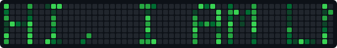

# About Me
After learning vanilla coding, I wanted to do more, so I picked up languages like Rust and C#. Still pretty new to all of this.

## Repo Spotlights
Quite a bit of my work lives in private repositories, so I can't showcase most of it here.

###  LowArc Studio
 

A desktop IDE for LowArc, a game engine built around small, independently-loadable modules. The Studio is where a project's modules get assembled, its code gets edited, and a dev build gets run and debugged, all in one app.

LowArc uses *modules* to act as the framework for your code, so you can code however you'd like: built to fit your needs, exactly. Plugins then layer on top of the IDE itself — the editor, terminal, debugger, 3D viewer and node graph are all plugins rather than fixed panels, each sandboxed and reaching the host through one small API.

Rust and Tauri v2 underneath, with a plain HTML/CSS/JS frontend and no bundler in front of it, so `cargo run` is the whole setup.

Windows-only for now, and the kinks aren't fully worked out, so the code is subject to large changes.
Initial release: **v1.0.0 Daedalus**.

###  Winding

A 3D renderer for the browser, written from scratch on WebGPU. No dependencies, no build step.

I wanted to find out what actually goes into a modern renderer instead of reading about one, so it is built the way a production renderer is rather than the way a tutorial is: GPU-driven culling, a render graph that works out its own pass ordering, clustered lighting, cascaded shadows, and a reverse-Z depth buffer with no far plane at all.

It is a renderer, not a game engine — no input, audio, or physics. Plenty is still missing, and the README says exactly what.

## Repo Lists
Every collection I create will be accessible here.

